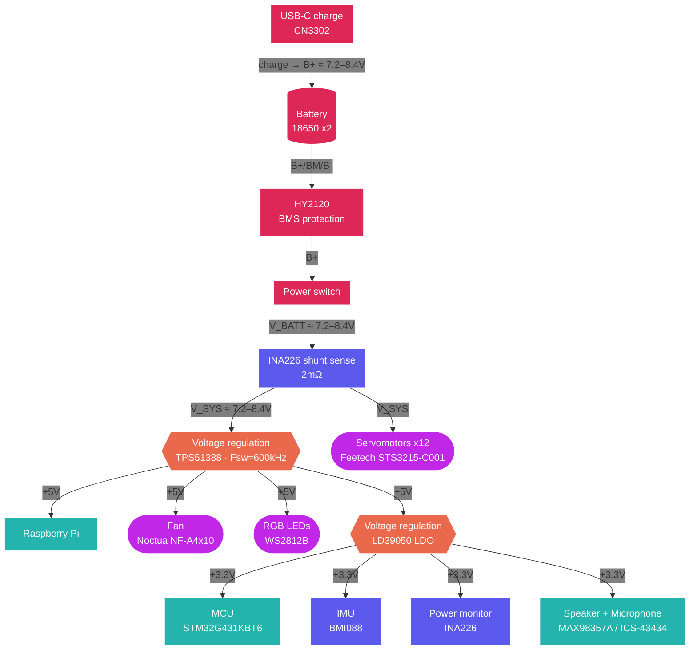

## Battery

Chromapi is powered by two 18650 Li-ion cells, housed in a holder inside its body.

| Property | Value |
| :--- | :--- |
| Cells | 2 Molicel INR18650-P28A |
| Configuration | 2S (series) |
| Nominal voltage | 7.2V |
| Voltage range | 6.0V - 8.4V |
| Capacity | 2800 mAh |
| Energy | ≈ 20 Wh |
| Max. discharge current (per cell) | 35 A |


Li-ion cells can be dangerous in case of short circuit, impact or deep discharge. Use brand-name cells, and never leave the robot charging unattended.


## Charging and protection

Chromapi has a USB-C charging port, directly on the motherboard. The board also includes a protection circuit against over-discharge, over-current and short circuits (BMS), to preserve the batteries and limit risks.

| Property | Value |
| :--- | :--- |
| Battery life | h |
| Charging time | h |

## Power monitoring

The robot's power consumption is continuously measured by an INA226, placed right after the power switch.

| Property | Value |
| :--- | :--- |
| Component | INA226 |
| Measured quantities | Voltage, current and power |
| Shunt resistor | 2 mΩ |
| Max. measurable current | 8 A |
| Interface | I2C at 400 kHz (address `0x40`) |
| Reading rate | 10 Hz |

The current voltage running through Chromapi is constantly displayed by a status LED on the motherboard.

## Regulation and distribution

| Rail | Regulator | Type | Loads |
| :--- | :--- | :--- | :--- |
| V_SYS (6.0 - 8.4V) | — | Battery voltage, after protection and monitoring | Servomotors |
| +5V | TPS51388 | Switching regulator (Buck), 600 kHz | Raspberry Pi, fan, RGB LED ring |
| +3.3V | LD39050 | Linear regulator (LDO), powered by the +5V rail | STM32 MCU, IMU, power monitor, audio amplifier and microphone |

## Power architecture

## Resources

* Schematics (PDF): [`hardware/schematic_pdf`](https://github.com/Mowibox/chromapi_motherboard/tree/main/hardware/schematic_pdf)
* Manufacturing files (Gerbers, BOM, CPL): [`hardware/production`](https://github.com/Mowibox/chromapi_motherboard/tree/main/hardware/production)
* Motherboard components: [PCB Bill of Materials]()
