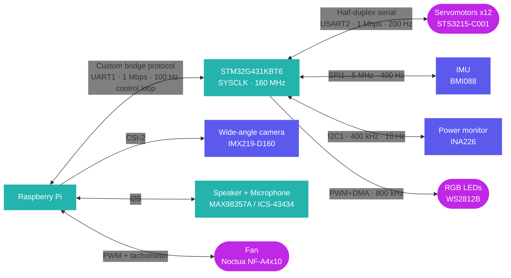

This page lists all the sensors and peripherals embedded in Chromapi.

## Overview

| Peripheral | Component | Interface | Handled by |
| :--- | :--- | :--- | :--- |
| Inertial measurement unit (IMU) | BMI088 | SPI at 5 MHz | Motherboard |
| Power monitoring | INA226 | I2C at 400 kHz | Motherboard |
| LED ring | WS2812B | PWM + DMA at 800 kHz | Motherboard |
| Wide-angle camera | IMX219-D160 | CSI-2 | Raspberry Pi |
| Speaker | MAX98357A | I2S | Raspberry Pi |
| Microphone | ICS-43434 | I2S | Raspberry Pi |
| Fan | Noctua NF-A4x10 PWM | PWM + tachometer | Raspberry Pi |

## Inertial measurement unit (IMU)

| Property | Value |
| :--- | :--- |
| Model | Bosch BMI088 (3-axis accelerometer + gyroscope) |
| Interface | SPI at 5 MHz |
| Accelerometer range | ±3 g |
| Gyroscope range | ±1000 °/s |
| Sampling rate | 400 Hz |
| Fusion filter | Mahony filter at 100 Hz |
| Output | Acceleration, angular velocity and orientation (quaternion) |


At startup, the Mahony filter calibrates the accelerometer and gyroscope biases over 500 samples: the robot must therefore stay still during initialization.


## Camera

| Property | Value |
| :--- | :--- |
| Model | Waveshare IMX219-D160 |
| Sensor | Sony IMX219 (8 MP) |
| Field of view | 160° (wide-angle, fisheye lens) |
| Interface | CSI-2 |

## Audio

| Function | Component | Details |
| :--- | :--- | :--- |
| Amplifier | MAX98357A | I2S class-D amplifier |
| Speaker | Xevtrak 4R3W | 4Ω, 3W |
| Microphone | ICS-43434 | I2S digital MEMS microphone |

## RGB LED ring

| Property | Value |
| :--- | :--- |
| Model | WS2812B COB Pixel Ring |
| Number of LEDs | 18 |
| Diameter | 27 mm |
| Driven by | STM32, PWM + DMA at 800 kHz |

## Cooling

| Property | Value |
| :--- | :--- |
| Model | Noctua NF-A4x10 PWM (40 × 40 × 10 mm) |
| Power supply | +5V |
| Control | PWM with tachometer feedback |

## Foot contact switches

The motherboard provides four inputs for microswitches placed at the tip of the legs, to detect ground contact.


Foot contact switches are not used in Chromapi v1.


## Communication architecture

## Resources

* Firmware drivers: [`bmi088.c`](https://github.com/Mowibox/chromapi_motherboard/blob/main/firmware/chromapi_stm32_core/Core/Src/bmi088.c), [`mahony.c`](https://github.com/Mowibox/chromapi_motherboard/blob/main/firmware/chromapi_stm32_core/Core/Src/mahony.c), [`ina226.c`](https://github.com/Mowibox/chromapi_motherboard/blob/main/firmware/chromapi_stm32_core/Core/Src/ina226.c) and [`ws2812b.c`](https://github.com/Mowibox/chromapi_motherboard/blob/main/firmware/chromapi_stm32_core/Core/Src/ws2812b.c)
* Python interfaces: [`src/chromapi/hardware`](https://github.com/Mowibox/chromapi/tree/main/src/chromapi/hardware) and [`src/chromapi/media`](https://github.com/Mowibox/chromapi/tree/main/src/chromapi/media)
