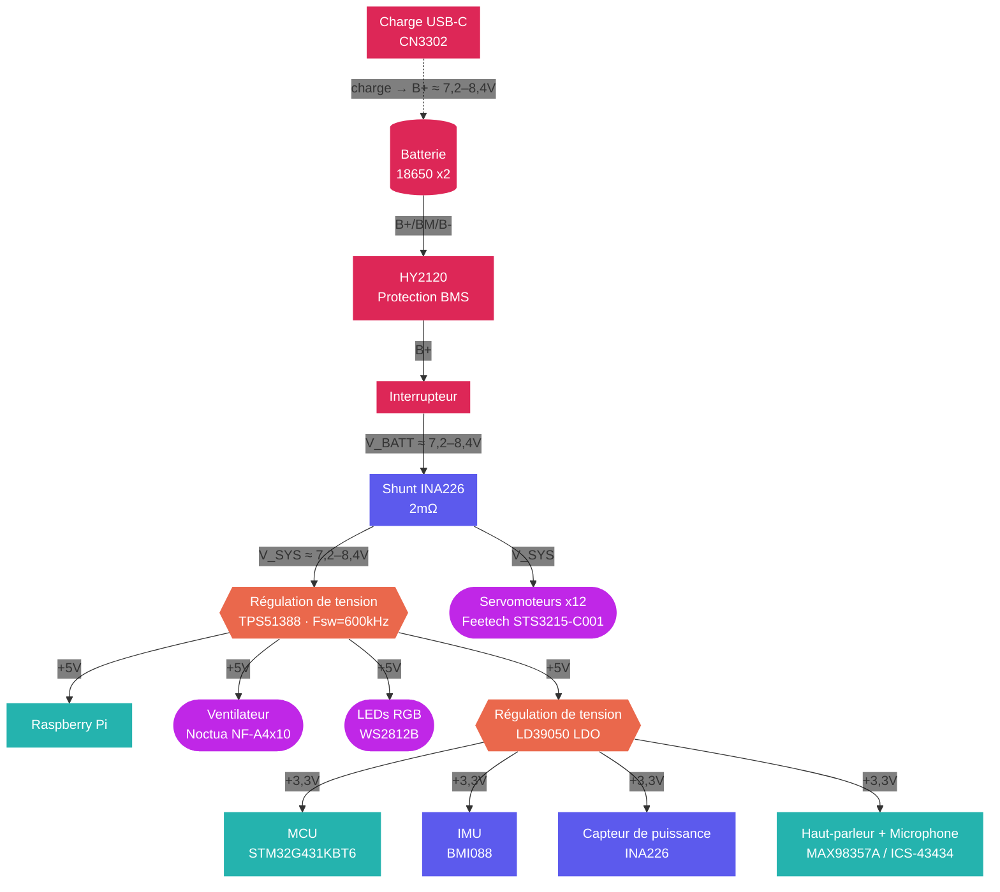

## Batterie

Chromapi est alimenté avec deux cellules Li-ion 18650, logées dans un support en son sein.

| Propriété | Valeur |
| :--- | :--- |
| Cellules | 2 Molicel INR18650-P28A |
| Configuration | 2S (série) |
| Tension nominale | 7,2V |
| Plage de tension | 6,0V - 8,4V |
| Capacité | 2800 mAh |
| Énergie | ≈ 20 Wh |
| Courant de décharge max. (par cellule) | 35 A |


Les cellules Li-ion peuvent être dangereuses en cas de court-circuit, de choc ou de décharge profonde. Utilisez des cellules de marque, et ne laissez jamais le robot charger sans surveillance.


## Charge et protection

Chromapi possède un port de charge USB-C, directement sur la carte mère. Cette dernière contient également un circuit de protection contre la décharge excessive, les surintensités et les courts-circuits (BMS), afin de préserver les batteries et limiter les risques. 

| Propriété | Valeur |
| :--- | :--- |
| Autonomie | h |
| Temps de charge | h |

## Mesure de puissance

La consommation du robot est mesurée en permanence par un INA226, placé juste après l'interrupteur d'alimentation.

| Propriété | Valeur |
| :--- | :--- |
| Composant | INA226 |
| Grandeurs mesurées | Tension, courant et puissance |
| Résistance de shunt | 2 mΩ |
| Courant max. mesurable | 8 A |
| Interface | I2C à 400 kHz (adresse `0x40`) |
| Fréquence de lecture | 10 Hz |

La tension actuelle qui traverse Chromapi est constamment affichée grâce à une LED de statut sur la carte mère.

## Régulation et distribution

| Rail | Régulateur | Type | Consommateurs |
| :--- | :--- | :--- | :--- |
| V_SYS (6,0 - 8,4V) | — | Tension batterie, après protection et mesure | Servomoteurs |
| +5V | TPS51388 | Régulateur à découpage (Buck), 600 kHz | Raspberry Pi, ventilateur, anneau de LEDs RGB |
| +3,3V | LD39050 | Régulateur linéaire (LDO), alimenté par le +5V | MCU STM32, IMU, capteur de puissance, amplificateur audio et microphone |

## Architecture d'alimentation

## Ressources

* Schémas électriques (PDF) : [`hardware/schematic_pdf`](https://github.com/Mowibox/chromapi_motherboard/tree/main/hardware/schematic_pdf)
* Fichiers de fabrication (Gerbers, BOM, CPL) : [`hardware/production`](https://github.com/Mowibox/chromapi_motherboard/tree/main/hardware/production)
* Composants de la carte mère : [Liste de matériel du PCB]()
