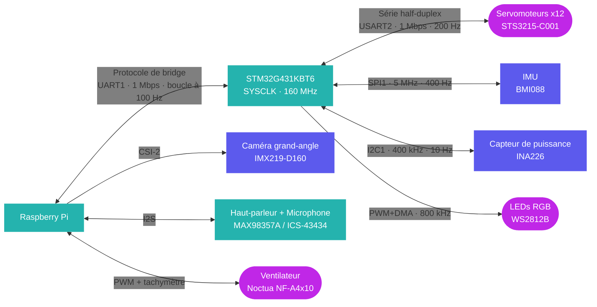

Cette page liste l'ensemble des capteurs et périphériques embarqués sur Chromapi.

## Vue d'ensemble

| Périphérique | Composant | Interface | Géré par |
| :--- | :--- | :--- | :--- |
| Centrale inertielle (IMU) | BMI088 | SPI à 5 MHz | Carte mère |
| Mesure de puissance | INA226 | I2C à 400 kHz | Carte mère |
| Anneau LEDs | WS2812B | PWM + DMA à 800 kHz | Carte mère |
| Caméra grand-angle | IMX219-D160 | CSI-2 | Raspberry Pi |
| Haut-parleur | MAX98357A | I2S | Raspberry Pi |
| Microphone | ICS-43434 | I2S | Raspberry Pi |
| Ventilateur | Noctua NF-A4x10 PWM | PWM + tachymètre | Raspberry Pi |

## Centrale inertielle (IMU)

| Propriété | Valeur |
| :--- | :--- |
| Modèle | Bosch BMI088 (accéléromètre + gyroscope 3 axes) |
| Interface | SPI à 5 MHz |
| Plage de l'accéléromètre | ±3 g |
| Plage du gyroscope | ±1000 °/s |
| Fréquence d'échantillonnage | 400 Hz |
| Filtre de fusion | Filtre de Mahony à 100 Hz |
| Sortie | Accélération, vitesse angulaire et orientation (quaternion) |


Au démarrage, le filtre de Mahony calibre les biais de l'accéléromètre et du gyroscope sur 500 échantillons : le robot doit donc rester immobile pendant l'initialisation.


## Caméra

| Propriété | Valeur |
| :--- | :--- |
| Modèle | Waveshare IMX219-D160 |
| Capteur | Sony IMX219 (8 MP) |
| Champ de vision | 160° (grand-angle, objectif fisheye) |
| Interface | CSI-2 |

## Audio

| Fonction | Composant | Détails |
| :--- | :--- | :--- |
| Amplificateur | MAX98357A | Amplificateur classe D I2S |
| Haut-parleur | Xevtrak 4R3W | 4Ω, 3W |
| Microphone | ICS-43434 | Microphone MEMS numérique I2S |

## Anneau de LEDs RGB

| Propriété | Valeur |
| :--- | :--- |
| Modèle | WS2812B COB Pixel Ring |
| Nombre de LEDs | 18 |
| Diamètre | 27 mm |
| Pilotage | STM32, PWM + DMA à 800 kHz |

## Ventilation

| Propriété | Valeur |
| :--- | :--- |
| Modèle | Noctua NF-A4x10 PWM (40 × 40 × 10 mm) |
| Alimentation | +5V |
| Pilotage | PWM avec retour tachymétrique |

## Contacteurs de pied

La carte mère prévoit quatre entrées pour des microinterrupteurs placés au bout des pattes, afin de détecter le contact au sol.


Les contacteurs de pied ne sont pas utilisés dans la v1 de Chromapi.


## Architecture de communication

## Ressources

* Pilotes firmware : [`bmi088.c`](https://github.com/Mowibox/chromapi_motherboard/blob/main/firmware/chromapi_stm32_core/Core/Src/bmi088.c), [`mahony.c`](https://github.com/Mowibox/chromapi_motherboard/blob/main/firmware/chromapi_stm32_core/Core/Src/mahony.c), [`ina226.c`](https://github.com/Mowibox/chromapi_motherboard/blob/main/firmware/chromapi_stm32_core/Core/Src/ina226.c) et [`ws2812b.c`](https://github.com/Mowibox/chromapi_motherboard/blob/main/firmware/chromapi_stm32_core/Core/Src/ws2812b.c)
* Interfaces Python : [`src/chromapi/hardware`](https://github.com/Mowibox/chromapi/tree/main/src/chromapi/hardware) et [`src/chromapi/media`](https://github.com/Mowibox/chromapi/tree/main/src/chromapi/media)
